# Sports Venue Booking Platform

Microservices-based sports venue booking platform (Java/Spring Boot) with
event-driven Saga pattern, Docker, and CI/CD.

**Status:** Core system complete (Aug 2026). Optional enhancements listed
below may be added as time allows.

## Architecture

6 independently deployable Spring Boot microservices, plus an API Gateway,
communicating via REST (synchronous) and RabbitMQ (asynchronous events for
the booking saga). Orchestrated locally with Docker Compose.

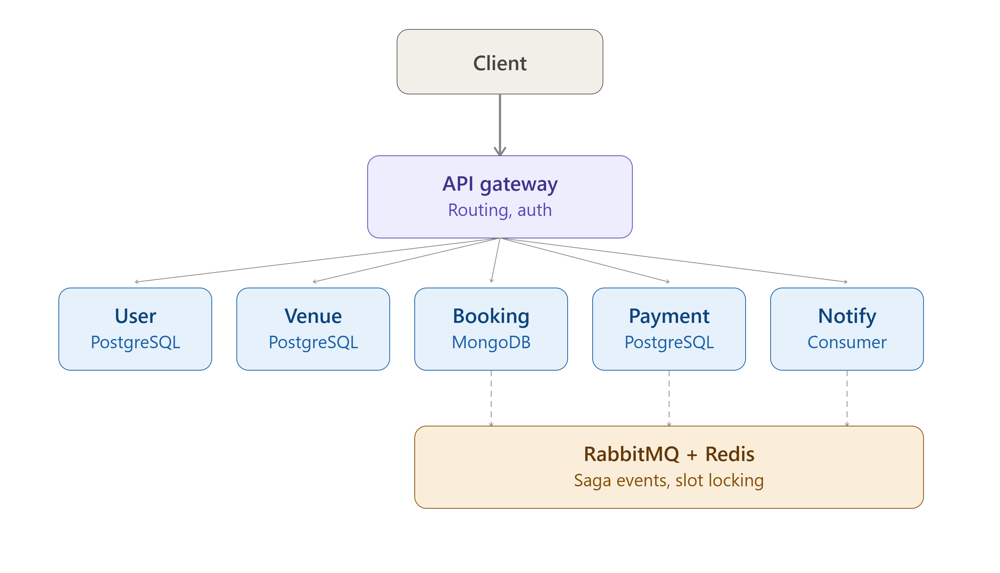

| Service | Responsibility | Database | Status |
|---|---|---|---|
| API Gateway | Routing, JWT validation | — | ✅ Complete |
| User Service | Auth (JWT), user profiles, RBAC | PostgreSQL | ✅ Complete |
| Venue Service | Venue/court management, browse/search | PostgreSQL | ✅ Complete |
| Booking Service | Booking lifecycle, Saga orchestration, Redis slot-locking | MongoDB | ✅ Complete |
| Payment Service | Payment processing (event-driven, simulated) | PostgreSQL | ✅ Complete |
| Notification Service | Email notifications (event consumer) | PostgreSQL | ✅ Complete |

## Tech Stack

- Java 25, Spring Boot 4.1.0, Maven
- PostgreSQL, MongoDB, Redis, RabbitMQ
- Spring Cloud Gateway (reactive/WebFlux)
- Docker, Docker Compose, GitHub Actions CI/CD
- Testcontainers, JUnit 5, Mockito, AssertJ
- GitHub Container Registry (image publishing)
- Spring Mail + Mailtrap (sandboxed email delivery)

## Getting Started

**Prerequisites:** Docker, Docker Compose

```bash
git clone https://github.com/ahmadisyraf39/sports-venue-booking.git
cd sports-venue-booking
cp .env.example .env   # add your own Mailtrap sandbox credentials
docker compose up
```

This starts all 6 services plus PostgreSQL (×4), MongoDB, Redis, and
RabbitMQ. Once running:

- **Gateway (single entry point):** http://localhost:8080
- **RabbitMQ management UI:** http://localhost:15672 (guest/guest)
- Individual services are also directly reachable on their own ports
  (8081-8085) for debugging - see each service's own README.

Postman collection: [`/postman/collection.json`](./postman)

## The Booking Saga, end to end

```
Client -> Gateway (JWT validated) -> Booking Service
                                       |
                          checks Venue Service for court + real price
                                       |
                          acquires Redis lock, checks for slot conflicts
                                       |
                          saves Booking (PENDING), publishes BookingCreated
                                       v
                                Payment Service
                          (consumes event, simulates payment,
                           publishes PaymentConfirmed/Failed)
                                       v
                             Notification Service
                          (consumes event, saves a NotificationLog,
                           sends a real email via Mailtrap sandbox)
```

A single `POST /api/bookings` request through the Gateway triggers this
entire chain automatically - verified live, including the resulting email
landing in a Mailtrap sandbox inbox.

## Key Design Decisions

- **Polyglot persistence**: PostgreSQL for relational, consistency-critical
  data (users, venues, payments, notifications); MongoDB for Booking
  Service's naturally nested, flexible document data.
- **JWT authentication**: issued by User Service, validated at the Gateway
  (a reactive `GlobalFilter`) - public paths (`/api/auth/**`) pass through
  unchecked, everything else requires a valid Bearer token.
- **Event-driven Saga**: Booking Service orchestrates booking -> payment ->
  notification via RabbitMQ, with each service only aware of the events it
  publishes/consumes, not of other services' internals.
- **Redis-based slot locking**: an atomic `SETNX` lock (10s auto-expiring
  safety net) prevents two concurrent requests from double-booking the same
  court/date/time slot.
- **Idempotency guards**: both Payment and Notification services check for
  already-processed events before acting, protecting against RabbitMQ's
  at-least-once delivery guarantee - a real duplicate was caught live during
  development (see `notification-service/README.md`).

## Known Simplifications

- Recipient email addresses are derived from user ID as a placeholder
  (`user{id}@example.com`), since real emails aren't yet passed through the
  event chain from User Service.
- Payment processing is simulated - no real payment gateway integration
  (a deliberate scope decision; the focus is the event-driven architecture).
- Service-to-service URLs are direct/hardcoded (via environment variables),
  not resolved through a service registry like Eureka.
- No dead-letter queue / retry policy configured for RabbitMQ consumers.

## Screenshots

**Full stack running locally via Docker Compose** - all 6 services, 4
PostgreSQL instances, MongoDB, Redis, and RabbitMQ:

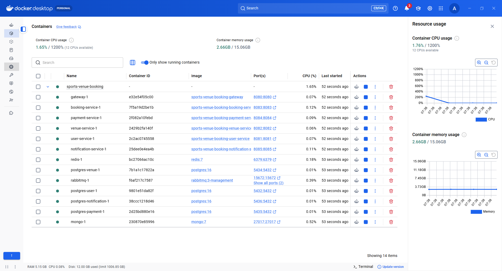

**CI** - required tests passing before a pull request can merge:

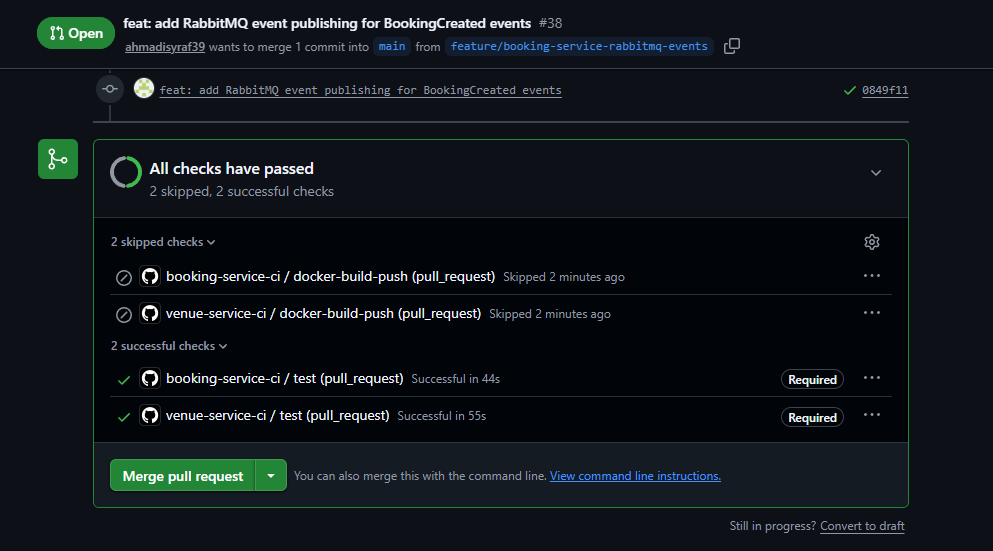

**CD** - Docker image built and pushed to GHCR on merge to `main`:

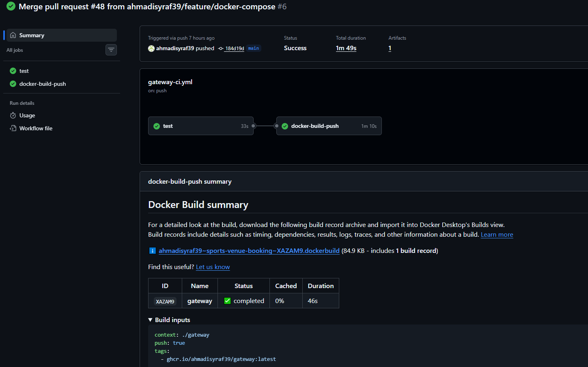

**Workflow history** - CI/CD runs across services over the project timeline:

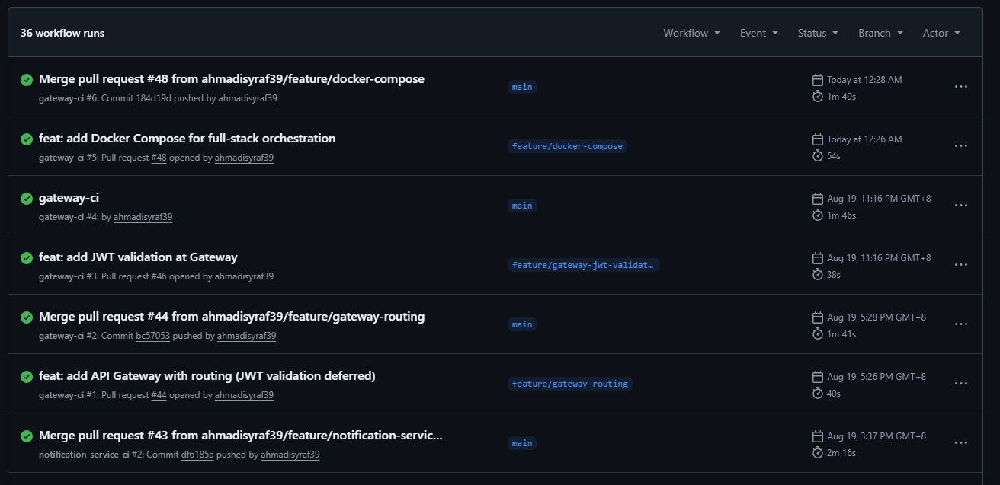

**End-to-end saga verification** - a real email landing in the Mailtrap
sandbox inbox after `POST /api/bookings` runs the full booking -> payment ->
notification chain:

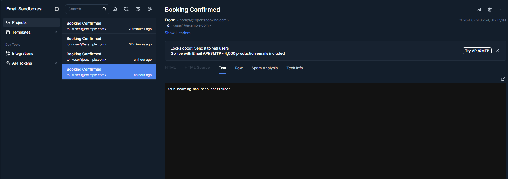

**Double-booking prevention** - the Redis-based slot lock rejecting a
conflicting booking for the same court/date/time:

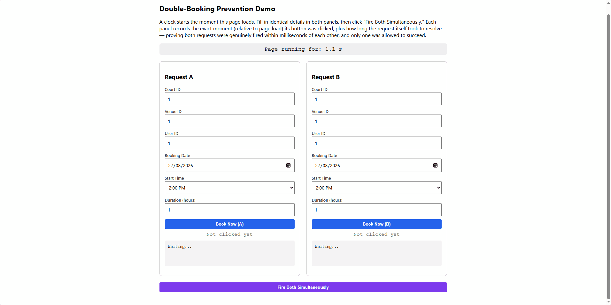

Firing both requests simultaneously to confirm the lock holds under a genuine
race, not just sequential requests:

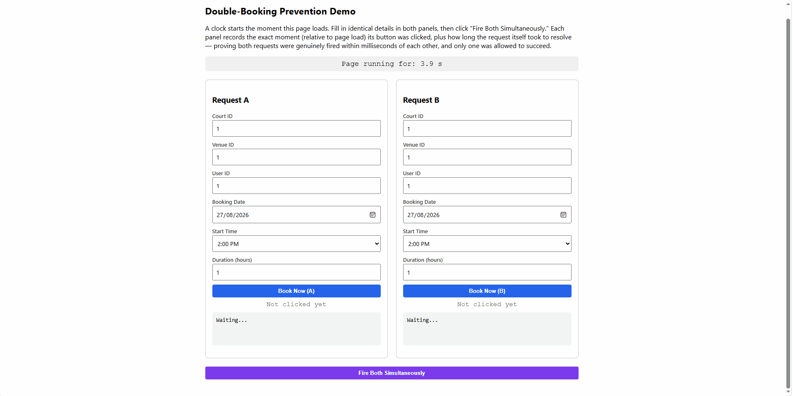

**Scaling demonstration** - JMeter load test (100 concurrent threads, 1000
requests) comparing booking-service at 1 replica vs 3 replicas; see
[`demo/SCALING_RESULTS.md`](./demo/SCALING_RESULTS.md) for full results:

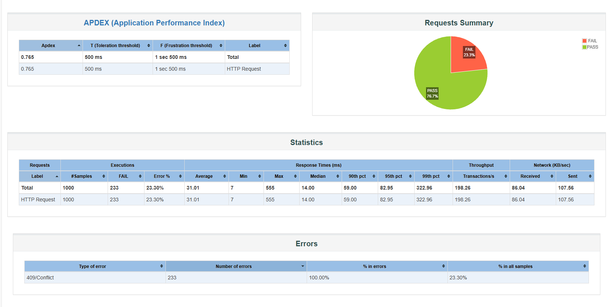

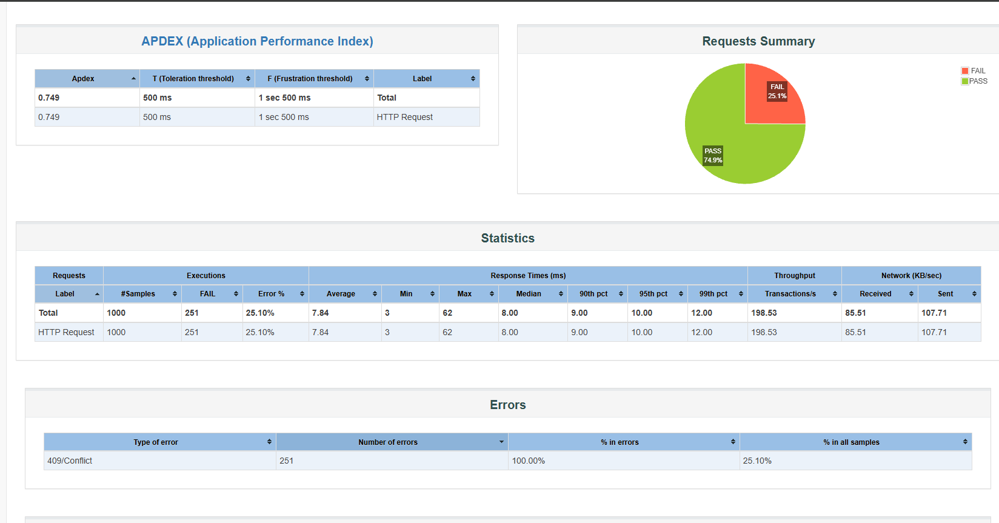

## AI-Assisted Development

Later services in this repo were scaffolded using Claude Code, after
establishing the architecture pattern manually in User Service (entities,
JWT auth, Docker, CI/CD - all built and debugged by hand first). Each
AI-generated service was thoroughly reviewed before merging, including
several real bugs and design gaps caught during review - see individual
service READMEs for the specific prompts used and documented findings:

- [`venue-service/README.md`](./venue-service)
- [`booking-service/README.md`](./booking-service)
- [`payment-service/README.md`](./payment-service)
- [`notification-service/README.md`](./notification-service)
- [`gateway/README.md`](./gateway)

AI was also used to help diagnose CI failures directly from job logs, e.g.
GitHub Copilot identifying a Testcontainers startup-timing issue in a
failing `payment-service` build:

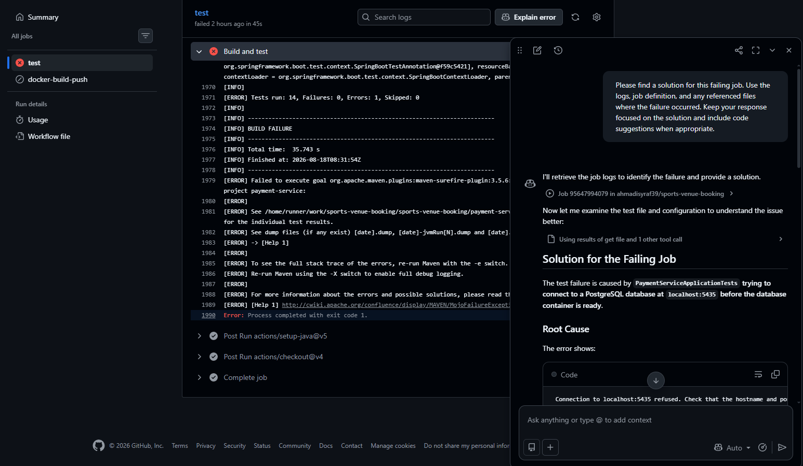

## Roadmap

- [x] User Service - entities, JWT auth, Docker, CI/CD
- [x] Venue Service - CRUD, Docker, CI/CD (Claude Code-assisted, reviewed)
- [x] Booking Service - Saga orchestration, Redis locking, MongoDB, RabbitMQ
- [x] Payment Service - event-driven, simulated payment processing
- [x] Notification Service - event consumer, real email via Mailtrap
- [x] API Gateway - routing, JWT validation
- [x] Docker Compose - full system orchestration

**Optional enhancements (not required for core completeness):**
- [ ] Observability stack (Prometheus, Grafana, Zipkin)
- [x] Scaling demonstration (horizontal scaling + load test)
- [x] Live double-booking prevention demo page
- [ ] Recommendation Service (stretch goal)
- [ ] Kubernetes deployment (stretch goal)

## License